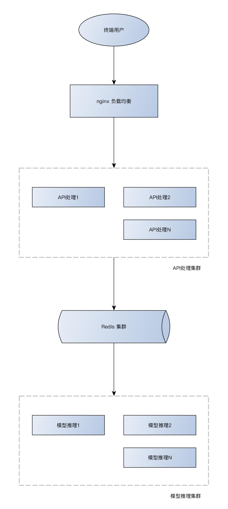

# Go实现的模型推理和api部署框架

深度学习模型在部署时通常以云方式部署，通过api对外体提供推理服务。这个框架提供了部署api时的基本架构组件，实现了几个目标：
- api调用模块与模型推理模块解构，可进行分布式部署
- api调用模块与模型推理模块均可实现横向扩展
- 使用Go语言实现，提高执行效率，简化部署和运维
- 框架使用类似callback形式，隐藏通用逻辑，开发时只需关注业务逻辑
- 服务端配置使用yaml，分布式部署时可进行针对性配置

## 分布式部署架构

## 开发文档

[API 接口定义](doc/API.md)

