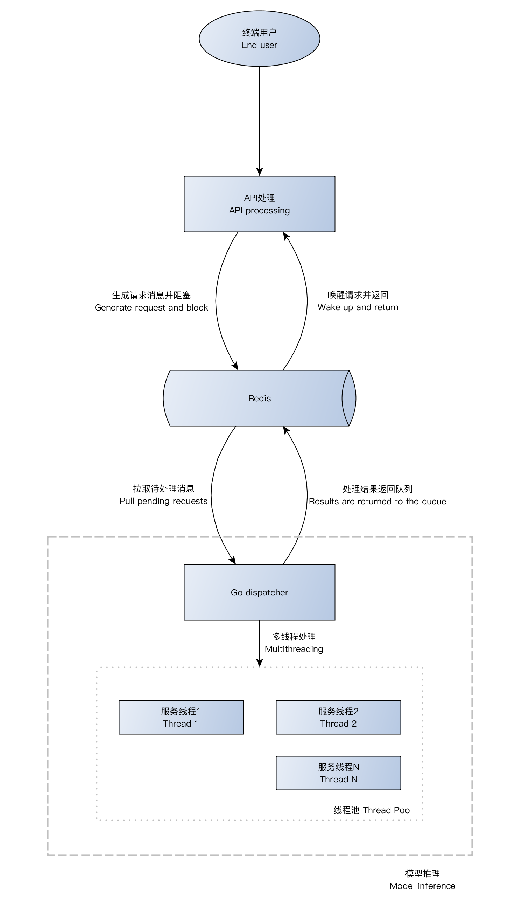

## 开发指南

以下简述使用go-infer快速构建模型推理api、和部署的过程。具体代码可以参考[examples](../examples)目录下完整示例。


### 1. 设计思路

请求处理流程如下图。go-infer框架隐藏了API并发请求处理、推理请求序列化排队、Dispatcher分发服务等通用逻辑，用户开发时，只需要处理API请求所带的参数（API入口函数）和模型推理部分（模型推理函数）。




代码实现中，框架定义了一个简化的model interface，用户只要实现其下的方法函数，就可以由框架实现上图中的流程。model interface定义如下：

```go
// 模型接口定义
type Model interface {
	ApiPath() (string) // HTTP URL 路径
	ApiEntry(*map[string]interface{}) (*map[string]interface{}, error)  // 处理API参数的过程
	Init() (error)  // 模型初始化，装入权重等
	Infer(*map[string]interface{}) (*map[string]interface{}, error)  // 模型推理的过程
}
```


- ApiPath() 比较简单，返回API的URL路径字符串，在HTTP server启动时，会根据这个串注册URL服务。
- ApiEntry() 用于对API传入的参数进行处理，通常根据业务逻辑对参数进行合法性检查。入参为一个key-value map，包含API传入的data字段的内容（API入参结构请参考[API文档模板](API.md)），返回值也是一个key-value map，包含传给推理函数的内容。
- Init() 用于载入模型权重和模型初始化相关的工作，在Dispatcher server启动时，会被调用。
- Infer() 用于实现具体的推理服务，入参是ApiEntry()处理过的参数数据，出参是将在API返回结果中data字段返回的内容。


具体示例可以参考[代码示例](../examples/models/embedding/bert_embedding.go)


### 4. 命令行集成

框架提供命令行集成，可以集成到用户的命令行指令中：

```go
// 添加模型实例
types.ModelList = append(types.ModelList, &embedding.BertEMB{})

// 命令行设置
rootCmd.AddCommand(cli.HttpCmd)
rootCmd.AddCommand(cli.ServerCmd)
```

在添加命令行之前，要将上述实现的model interface添加到框架的ModelList中，框架会进行初始化和注册等工作，并在请求处理时找到对应的模型。


具体可以参考[代码示例](../examples/main.go)


### 5. 配置文件

具体可以参考[配置文件示例](../examples/config/settings.yaml)


### 6. 模型权重导出

#### (1) Tensorflow权重导出

可参考[export_tf_bert.py](../examples/export/export_tf_bert.py)


#### (2) Keras权重导出

可参考[export_keras_cnn.py](../examples/export/export_keras_cnn.py)


### 7. 系统部署

#### (1) 本地测试

编译

```bash
cd examples
make	
```


启动Dispatch分发和推理服务

```bash
build/go-embedding server 0
```


启动Http API服务

```bash
build/go-embedding http
```


API测试

```bash
python3 test_api localhost mobile
```


#### (2) 分布式架构部署

go-infer框架已经实现了API并发处理（Http server）和推理模块（Dispatcher server）序列化执行，因此在实际应用部署中，主要考虑应对并发高峰期时的处理能力。当高峰期并发量不高时，可以选择单机部署，即将Http server和Dispatcher server部署在同一台物理服务器上。当高峰期并发量增加时，主要有3种方案提高并发处理能力（这里只考虑CPU环境的部署）：

1. 增加单台服务器的算力
2. Http server、Dispatcher server和redis分别部署在3台不同的服务器上
3. 在方案2基础上分析算力瓶颈，分别对Http server和Dispatcher进行横向扩展


此处以方案3为例，进行示范，部署架构参考下图：


首先，假设部署环境：

1. nginx服务器1台（192.168.0.100）做API请求入口，并做负载均衡
2. redis服务器1台（192.168.0.101）（考虑系统稳定性，可以部署redis集群，具体请参考redis文档）
3. Http服务器2台（192.168.0.102, 192.168.0.103）提供API处理服务
4. Dispatcher服务器4台（192.168.0.104, 192.168.0.105, 192.168.0.106, 192.168.0.107）

其中，为了将API请求比较均衡的分发到推理服务器，建立两个redis队列，每个Http server关联一个队列，每个队列后端关联两台Dispather server。如此，每个Http server的并发请求由两个Dispatcher server进行处理。并且，每个Dispatcher server按CPU核心数量设置MaxWorkers参数。（假设服务器为8核心）


> 注意：以下只是配置文件片段，其他内容需补充完整


##### 1. nginx.conf

```nginx
upstream goinfer {
    least_conn;
    server 192.168.0.102:5000;
    server 192.168.0.103:5000;
}


server {
    listen 5000;
    location / {
      proxy_pass http://goinfer;
    }
}
```


##### 2. redis.conf

```redis
bind 192.168.0.101
port 7480
requirepass e18ffb7484f4d69c2acb40008471a71c
client-output-buffer-limit pubsub 32mb 8mb 60
```


##### 3. settings.yaml 共用配置

```yaml
# HTTP 服务端参数
API:
    Port: 5000
    Addr: 0.0.0.0
    SM2PrivateKey: "JShsBOJL0RgPAoPttEB1hgtPAvCikOl0V1oTOYL7k5U=" # SM2私钥
    AppIdSecret: { # 接口调用分配的 appid 和 sevret
        "3EA25569454745D01219080B779F021F" : "41DF0E6AE27B5282C07EF5124642A352",
    }

# 推理服务队列的参数
Server:
    RedisServer: "127.0.0.1:7480"
    RedisPasswd: "e18ffb7484f4d69c2acb40008471a71c"
    MessageTimeout: 10 # 推理计算最大等待时间
    MaxWorkers: 8 # 模型推理最大并发数，与CPU核心数相同
```


##### 4. Http server 

192.168.0.102 的settings.yaml

```yaml
Server:
    QueueName: "goinfer-synchronous-asynchronous-queue_102"
```


192.168.0.103 的settings.yaml

```yaml
Server:
    QueueName: "goinfer-synchronous-asynchronous-queue_103"
```

启动命令

```bash
build/go-embedding http
```


##### 5. Dispatcher server

###### 192.168.0.104 

settings.yaml

```yaml
Server:
    QueueName: "goinfer-synchronous-asynchronous-queue_102"
```

启动命令

```bash
build/go-embedding server 0
```


###### 192.168.0.105 

settings.yaml

```yaml
Server:
    QueueName: "goinfer-synchronous-asynchronous-queue_102"
```

启动命令

```bash
build/go-embedding server 1
```


###### 192.168.0.106

settings.yaml

```yaml
Server:
    QueueName: "goinfer-synchronous-asynchronous-queue_103"
```

启动命令

```bash
build/go-embedding server 0
```


###### 192.168.0.107

settings.yaml

```yaml
Server:
    QueueName: "goinfer-synchronous-asynchronous-queue_103"
```

启动命令

```bash
build/go-embedding server 1
```


##### 6. 测试

```bash
python3 test_api "192.168.0.100" mobile
```

